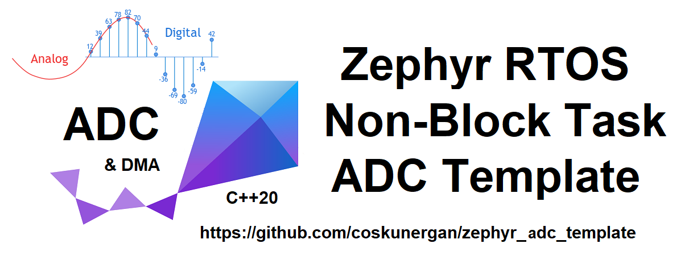

# ZephyrRTOS Workspace Application Template ::ZPP C++20 API

This repositories on the hardware independent zephyr rtos project, one of the popular topics of recent years. It is also a new proof that embedded systems can meet the needs of C++. My workspace uses ZephyrRTOS and ZPP C++20 API. It is where you can start from basic hardware and run advanced 3rd party applications.  

Must install the ZPP module under the zephyr folder before compiling.

Zephyr started guide installation and more see:
https://docs.zephyrproject.org/latest/develop/getting_started/index.html

Zephyr RTOS repositories see:
https://github.com/zephyrproject-rtos/zephyr

ZPP Module installation:
https://github.com/lowlander/zpp

For a helpful setup and test utility see:
https://github.com/lowlander/zpp_bootstrap
